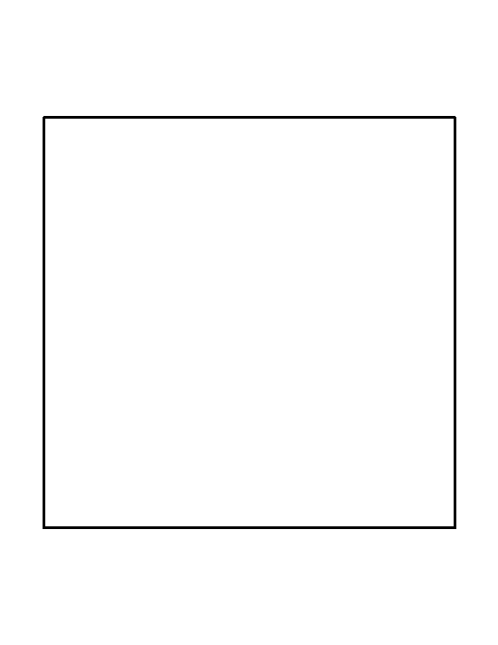
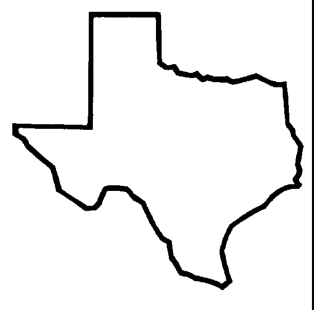
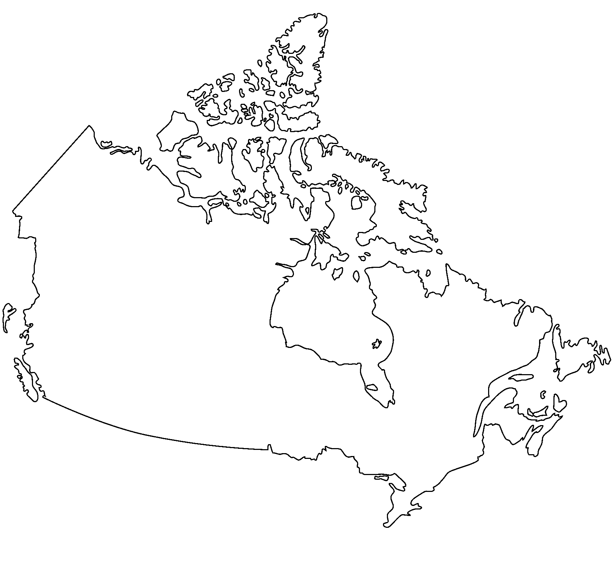
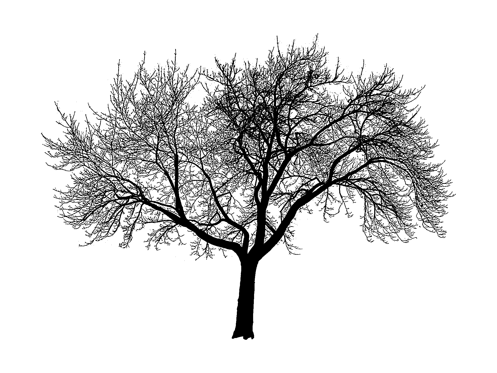

Title: Fractal Dimension
Category: Software
Tags: Python
Author: Trevor
Date: 2017-01-24


Inspired by the [keynote](https://www.youtube.com/watch?v=bSfe5M_zG2s) given at PyCon Portland by K Lars Lohn,, I wanted to try my hand 
at computing the fractal dimension of a few different images.


This is a very simple implementation of a [box counting](https://en.wikipedia.org/wiki/Minkowski%E2%80%93Bouligand_dimension) algorithm.

A couple of ideas are borrowed from https://github.com/twobraids/fracdim.


First some imports:

```python
import pandas
import math
from IPython.display import display
from PIL import Image
import os
from  scipy.stats import linregress
```

Then a function to create simple black and white images.

```python
def bw(img):
    gray = img.convert('L')
    return gray.point(lambda x: 0 if x<128 else 1, '1')

```

Some sample images.  Basically, I expect the fractal dimension of the Canadian
coastline to be higher than that of, say, a square.


```python
texas=bw(Image.open('./images/texas.gif'))
tree=bw(Image.open('./images/tree.jpg'))
canada=bw(Image.open('./images/Canada.png'))
square=bw(Image.open('./images/square.jpg'))

```

At various different scales, I want to divide each image up into squares and 
then count how many squares have at least one black pixel in them.

```python
def interesting(image):
    #true if any data is 0, i.e. black
    return 0 in set(image.getdata())
```

This function chops an image up into 

```python
def interesting_box_count(image, length):
    width,height=image.size
    
    interesting_count=0
    box_count=0
    for x in range(int(width/length)):
        for y in range(int(height/length)):
            C=(x*length,y*length,length*(x+1),length*(y+1))

            chopped = image.crop(C)
            box_count+=1
            if (interesting(chopped)):
                interesting_count+=1        
      
    assert box_count
    assert interesting_count
    return interesting_count
```


This returns pairs of numbers. One represents the scale, the other the (log) count 
of boxes at that scale that have black pixels in them.

```python
def getcounts(image):
    length=min(image.size)
    while(length>5):
        interesting = interesting_box_count(image,length)
        yield math.log(1.0/length), math.log(interesting)
        length=int(length/2)
        
def counts(image):
    return pandas.DataFrame(getcounts(image),columns=["x","y"])
```


```python
def dimension(image):
    frame=counts(image)
    return linregress(frame.x,frame.y)
```

And finally, armed with lists of pairs, we compute the slope we'd get if we 
plotted them against each other.


```python
def analyse(image):
    c=counts(image)
    print("Fractal Dimension:",linregress(c.x,c.y).slope)
```


### Results

```python
square
```





```python
analyse(square) 
```

    Fractal Dimension: 1.26420823227


```python
texas
```



```python
analyse(texas)
```

    Fractal Dimension: 1.45764518178


```python
canada
```



```python
analyse(canada)
```

    Fractal Dimension: 1.52450994232


```python
tree

```





```python
analyse(tree)
```

    Fractal Dimension: 1.82487974473


**Which is exactly what we expected.**

As K Lars Lohn said in his keynote, it's very rewarding when you try something out in Python and the result actually matches neatly up with the theory!