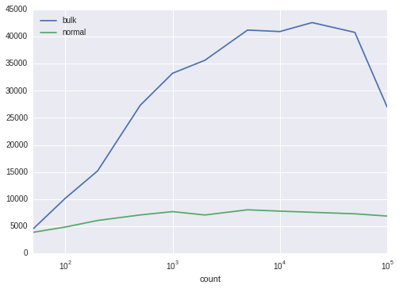

Efficient Postgres Bulk Inserts using Psycopg2 and Unnest
=========================================================

:tags: Python, Postgres
:category: Database
:author: Trevor
:date: 2015-10-22
:slug: bulk-psycopg2-inserts

One of the biggest challenges I face maintaining large Postgres systems
is getting data *into* them in an efficient manner. Postgres is very,
very good at maintaining, organising, querying and retrieving data, but
inserts themselves can be quite slow.

Various stackoverflow questions suggest using things like :code:`COPY`, but
that assumes your application has direct write access to the machine
that is running Postgres, and I work very hard to maintain strict
seperation of functionality between software components.

So I've been looking for a faster way of inserting, say, 100,000 rows
into the database across the wire, and what follows is by far the most
efficient technique I've found so far.

Set some visualisation options
~~~~~~~~~~~~~~~~~~~~~~~~~~~~~~

.. code-block:: python

    %matplotlib inline
    import seaborn

Import the libraries we'll be using
~~~~~~~~~~~~~~~~~~~~~~~~~~~~~~~~~~~

.. code-block:: python

    import pandas
    from numpy import array_split
    import psycopg2
    from psycopg2.extras import Json
    import time
    import contextlib

A context manager for timing operations.
~~~~~~~~~~~~~~~~~~~~~~~~~~~~~~~~~~~~~~~~

.. code-block:: python

    @contextlib.contextmanager
    def timer(name="duration"):
        'Utility function for timing execution'
        start=time.time()
        yield
        duration=time.time()-start
        print("{0}: {1} second(s)".format(name,duration))

Test setup
~~~~~~~~~~

My tests are based on creating a fairly simple table and timing how long
it takes to perform inserts on it via several different methods. The
table has a couple of default columns, a text column, and an HSTORE
column.

.. code-block:: python

    
    SETUP_SQL="""
        DROP TABLE IF EXISTS upload_time_test;
        
        CREATE TABLE upload_time_test(
            uuid uuid primary key default uuid_generate_v4(),
            created timestamp with time zone not null default now(),
            text text not null,
            properties hstore not null default ''::hstore
        );
        
        GRANT ALL ON upload_time_test TO test;
    """

This is the SQL we'll use for inserting a single row into the database
table:

.. code-block:: python

    
    SINGLE_INSERT="""
        INSERT INTO upload_time_test(text,properties)
             VALUES (%(text)s, %(properties)s)
    """

Credentials for connecting to my local test database

.. code-block:: python

    HOST='localhost'
    DATABASE='test'
    USER='test'
    PASSWORD='password'

Then we define a couple of simple wrappers around :code:`psycopg2`

.. code-block:: python

    def connect():
        connection= psycopg2.connect(host=HOST,database=DATABASE,user=USER,password=PASSWORD)
        psycopg2.extras.register_hstore(connection)
        return connection
    def execute(sql,params={}):
        with connect() as connection:
            with connection.cursor() as cursor:
                cursor.execute(sql,params)

This is the heart of my tests. The :code:`Tester` class destroys and
re-creates the sample table every time we instantiate it.

It provides three different functions for inserting database rows, each
based on a different technique.

-  :code:`slowInsert()` is the slowest, because it creates a new database
   connection for each row
-  :code:`insert()` is the approach I had been using up till now. It creates
   one connection, and re-uses it for each insertion. This is basically
   what :code:`executemany()` in psycopg2 is doing.
-  :code:`fastInsert()` is my new approach, based on using **unnest()** to
   unroll a set of arrays passed in through psycopg2

.. code-block:: python

    class Tester():   
        def __init__(self,count):
            execute(SETUP_SQL)
            self.count=count
            
            self.data=[
                {
                    'text':'Some text',
                    'properties': {"key":"value"},
                }
                for i in range(count)
            ]
    
        def slowInsert(self):
            '''
                Creates a new connection for each insertion
            '''
            for row in self.data:
                text=row['text']
                properties=row['properties']
                execute(SINGLE_INSERT,locals())
            
        def insert(self):
            '''
                One connection.
                Multiple queries.
            '''
            with connect() as connection:
                with connection.cursor() as cursor:
                    for row in self.data:
                        text=row['text']
                        properties=row['properties']
                        cursor.execute(SINGLE_INSERT,locals())
                        
            
        def fastInsert(self):
            ''' 
                One connection, one query.
            '''
            sql='''
                INSERT INTO upload_time_test(text,properties)
                  SELECT unnest( %(texts)s ) ,
                         unnest( %(properties)s) 
    
            '''
            
            texts=[r['text'] for r in self.data]
            properties=[r['properties'] for r in self.data]
            execute(sql,locals())
       

So now we have the Tester class written, we can see how log each
approach takes to insert 1000 rows

.. code-block:: python

    def runTests(iterations):
        tester = Tester(iterations)
        with timer('slow'):
            tester.slowInsert()
        with timer('normal'):
            tester.insert()
        with timer('fast'):
            tester.fastInsert()

.. code-block:: python

    runTests(1000)

.. parsed-literal::

    slow: 7.160489320755005 second(s)
    normal: 0.1441025733947754 second(s)
    fast: 0.042119503021240234 second(s)

**We notice an obvious difference between the approaches.**

Re-using the connection makes a *huge* difference. Inserts run 50 times
faster.

Using :code:`unnest()` runs 3 times faster than that.

What about much bigger data sets?
---------------------------------

Next, I wanted to know if this held true for inserting, say, 100,000
rows. I won't bother with the slowest approach, because that's clearly
unusable.

.. code-block:: python

    tester=Tester(count=100000)
    with timer('normal'):
        tester.insert()
        
    tester=Tester(count=100000)
    with timer('fast'):
        tester.fastInsert()

.. parsed-literal::

    normal: 14.866096019744873 second(s)
    fast: 3.9566986560821533 second(s)

So even over 100,000 rows we still run nearly 4 times faster using
:code:`unnest`

Further investigation - mapping insertion rate against number of rows inserted.
-------------------------------------------------------------------------------

I wanted to see the exact relationship between the rate of insertion and
the number of rows being inserted.

So first I wrote a couple of functions to measure the insertion rate of
our two methods:

.. code-block:: python

    
    def bulkInsertRate(count):
        tester=Tester(count)
        start=time.time()
        tester.fastInsert()
        duration=time.time()-start
        return count/duration
    
    def normalInsertRate(count):
        tester=Tester(count)
        start=time.time()
        tester.insert()
        duration=time.time()-start
        return count/duration

And then we run them with a range of dataset sizes

.. code-block:: python

    counts=[50,100,200,500,1000,2000,5000,10000,20000,50000,100000]
    
    rates=[
        {
            "count":count,
             'bulk':bulkInsertRate(count),
            'normal':normalInsertRate(count)
                
        }
        for count in counts
    ]

Finally, I use Pandas to plot the output data from these tests.

.. code-block:: python

    frame=pandas.DataFrame(rates).set_index('count')
    frame

.. raw:: html

    

    <table border="1" class="dataframe table table-striped table-bordered">
      <thead>
        <tr style="text-align: right;">
          <th></th>
          <th>bulk</th>
          <th>normal</th>
        </tr>
        <tr>
          <th>count</th>
          <th></th>
          <th></th>
        </tr>
      </thead>
      <tbody>
        <tr>
          <th>50    </th>
          <td>  4485.694730</td>
          <td> 3867.856879</td>
        </tr>
        <tr>
          <th>100   </th>
          <td> 10159.389609</td>
          <td> 4847.897547</td>
        </tr>
        <tr>
          <th>200   </th>
          <td> 15212.186276</td>
          <td> 6057.106548</td>
        </tr>
        <tr>
          <th>500   </th>
          <td> 27340.842720</td>
          <td> 7081.049689</td>
        </tr>
        <tr>
          <th>1000  </th>
          <td> 33248.545382</td>
          <td> 7694.657609</td>
        </tr>
        <tr>
          <th>2000  </th>
          <td> 35640.695767</td>
          <td> 7070.777670</td>
        </tr>
        <tr>
          <th>5000  </th>
          <td> 41223.200473</td>
          <td> 8027.790910</td>
        </tr>
        <tr>
          <th>10000 </th>
          <td> 40948.723106</td>
          <td> 7785.005392</td>
        </tr>
        <tr>
          <th>20000 </th>
          <td> 42604.387914</td>
          <td> 7568.314015</td>
        </tr>
        <tr>
          <th>50000 </th>
          <td> 40795.233470</td>
          <td> 7291.552509</td>
        </tr>
        <tr>
          <th>100000</th>
          <td> 27014.354119</td>
          <td> 6872.935483</td>
        </tr>
      </tbody>
    </table>
    

.. code-block:: python

    frame.plot(logx=True)

.. parsed-literal::

    <matplotlib.axes._subplots.AxesSubplot at 0x7fcbdecd0908>

Conclusion
----------

Using :code:`unnest` to load multiple rows simultaneously has the following
advantages:

-  It is significantly faster than a regular insert loop, especially
   when inserting thousands of rows.
-  The benefits of using unnest() increase at least up to 50,000 rows
-  It still allows us to write (reasonably) straightforward
   parameterised SQL with no string concatenation
-  When I tried this on a remote database, the improvements were even
   more impressive, presumably as it reduces significantly how much data
   is transferred back and forth across the network.

